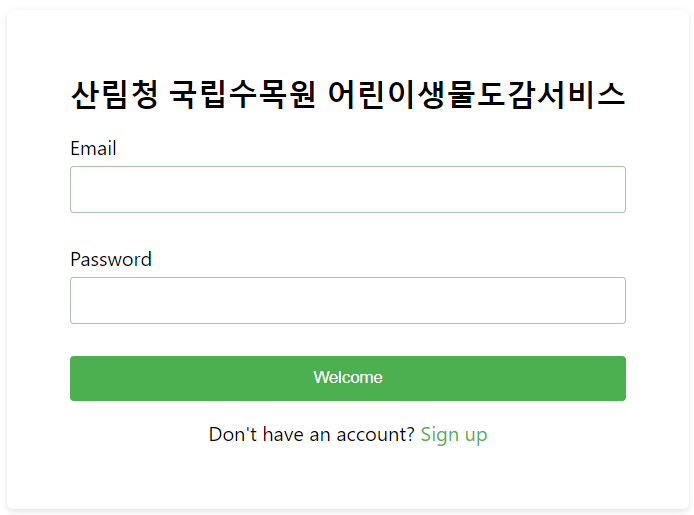
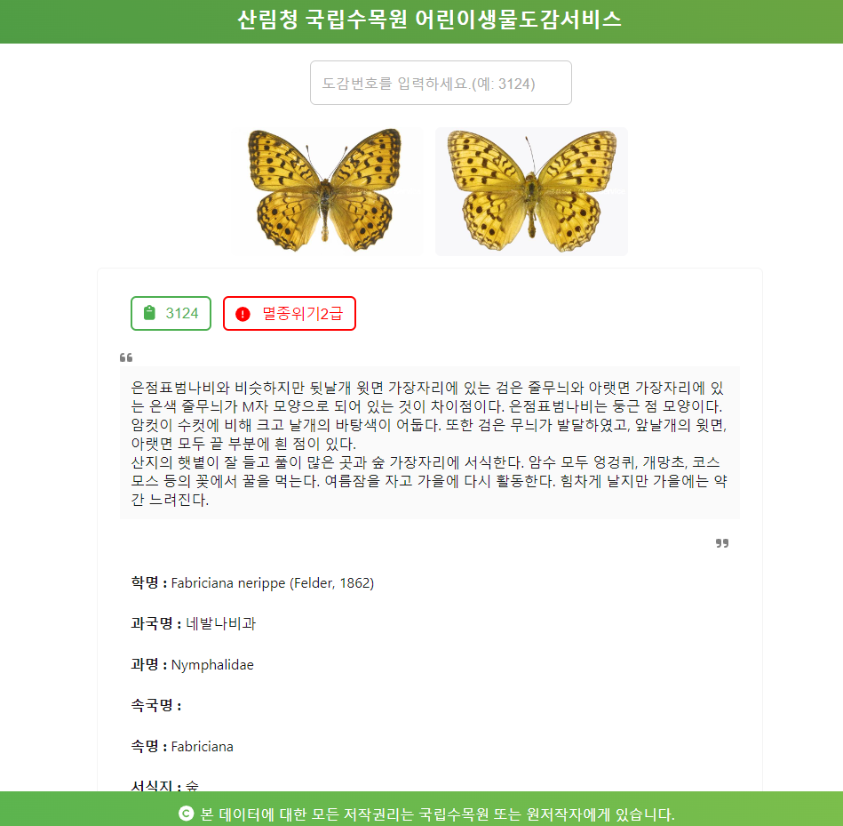

# 산림청 국립수목원 어린이생물도감서비스

### 소개
산림청 국립수목원 어린이생물도감서비스에 오신 것을 환영합니다. 이 서비스는 어린이들에게 식물과 동물의 신비한 세계를 제공하여 교육하고 영감을 주기 위해 설계된 인터랙티브 플랫폼입니다.

## 기능
### 🛡️ 안전한 로그인
- **Welcome** 버튼을 클릭하여 서비스를 이용하고 자연의 경이로움을 탐험해 보세요.

### 📚 포괄적인 생물도감
- **활용 데이터**: 공공데이터 포털의 산립청 국립수목원 어린이 생물도감 서비스 데이터를 활용합니다.
([https://apis.data.go.kr/1400119/ChildService1](https://www.data.go.kr/data/15037581/openapi.do))
- **API 엔드포인트**: [산림청 국립수목원 어린이 생물도감 서비스](https://apis.data.go.kr/1400119/ChildService1)

## 이용 방법
1. **로그인**: **Welcome** 버튼을 클릭하여 접근합니다. (현재 회원가입 없이 사용가능)

2. **생물도감 탐색**: 조회를 원하는 종의 도감번호를 입력하여 상세 정보를 확인합니다.

## 하이라이트
- **상세한 설명**: 다양한 종에 대한 상세 설명과 고품질 이미지를 제공합니다.
- **교육적 목적**: 어린 학습자와 교육자들이 식물과 동물에 대한 지식을 풍부하게 할 수 있도록 설계되었습니다.

## 예시
시작하려면 다음 단계를 따라주세요:
1. 플랫폼에 로그인합니다.
2. 검색 상자에 종 식별 번호(예: 3124)를 입력합니다.
3. 해당 종에 대한 상세 정보(이미지 및 설명 포함)를 즉시 확인할 수 있습니다.

## 감사의 말
이 서비스에서 사용된 모든 데이터는 [공공데이터 포털](https://www.data.go.kr/)에서 제공됩니다. 이 소중한 정보를 제공해 주신 국립수목원에 감사드립니다.

---

지금 바로 식물과 동물의 놀라운 세계를 탐험해 보세요!